# Swing hands-on

Welcome to the repository containing examples used in the Java Desktop Development with Swing classes taught by Rodrigo Martins Pagliares in the Computer Science undergraduate course at UNIFAL-MG, Brazil. 

I thinnk this repository is a valuable resource for students who want to review class examples or further explore Swing development. I hope you find it helpful and informative!

## Outline

### Part I - First steps with Swing

<a href="https://github.com/pagliares/swing-hands-on#01---first-jframe-composition">01 - First JFrame - Composition</a>

<a href="https://github.com/pagliares/swing-hands-on#02---first-jframe-inheritance">02 - Second JFrame - Inheritance</a>

<a href="https://github.com/pagliares/swing-hands-on#03---first-jpanel">03 - JPanel example</a>

<a href="https://github.com/pagliares/swing-hands-on#04---one-more-jpanel-example">04 - One more JPanel example</a>

## Part II - Layout managers

<a href="https://github.com/pagliares/swing-hands-on#05---flowlayout-example">05 - FlowLayout example</a>

<a href="https://github.com/pagliares/swing-hands-on#06---borderlayout-example">06 - BorderLayout example</a>

<a href="https://github.com/pagliares/swing-hands-on#07---gridlayout-example">07 - GridLayout example</a>

<a href="https://github.com/pagliares/swing-hands-on#08---boxlayout-example">08 - BoxLayout example</a>

<a href="https://github.com/pagliares/swing-hands-on#09---gridbaglayout-example">09 - GridBagLayout example</a>

## Part III - Event handlers, adapter classes, and inner classes

<a href="https://github.com/pagliares/swing-hands-on#10---actionlistener-example">10 - ActionListener example</a>

<a href="https://github.com/pagliares/swing-hands-on#11---mouselistener-example">11 - MouseListener example</a>

<a href="https://github.com/pagliares/swing-hands-on#12---inner-classes">12 - Inner classes</a>

<a href="https://github.com/pagliares/swing-hands-on#13---closing-a-jframe---strategy-1">13 - Closing a JFrame - Strategy #1</a>

<a href="https://github.com/pagliares/swing-hands-on#14---closing-a-jframe---strategy-2">14 - Closing a JFrame - Strategy #2</a>

<a href="https://github.com/pagliares/swing-hands-on#15---inner-classes-and-event-handling">15 - Inner classes and event handling</a>

<a href="https://github.com/pagliares/swing-hands-on#16---anonymous-classes-and-event-handling">16 - Anonymous classes and event handling</a>

## Part IV - Swing components

<a href="https://github.com/pagliares/swing-hands-on#17---jframe-and-changing-the-look-and-feel">17 - JFrame and changing the look and feel</a>

## Part I - First steps with Swing

### 01 - First JFrame (Composition)

- <small><a href="https://github.com/pagliares/swing-hands-on#outline">Back to Outline</a></small>
- <strong>Project source:</strong> first-jframe

<strong>Summary</strong>

This example creates a basic GUI window using the Swing framework. It is organized into a single class called PrimeiraJanela, which contains a single method called main().

The main() method is the entry point of the program and is the first method to be executed when the program is run. It creates a new JFrame object and sets its title to "Primeira janela" using the constructor.

Next, it sets the size of the window using the setSize() method, which takes two arguments: the width and height of the window in pixels. In this case, the width is set to 300 pixels and the height is set to 250 pixels.

Finally, the program sets the visibility of the window to true using the setVisible() method, which shows the window on the screen.

In summary, this code creates a basic Swing GUI window with a specified size and title and makes it visible on the screen. It's a simple but essential starting point for creating more complex GUI applications in Java.

 

### 02 - First JFrame (Inheritance)

- <small><a href="https://github.com/pagliares/swing-hands-on#outline">Back to Outline</a></small>
- <strong>Project source:</strong> second-jframe

<strong>Summary</strong>

This example is identical to the first except that this time I use inheritance instead of composition.

### 03 - First JPanel  

- <small><a href="https://github.com/pagliares/swing-hands-on#outline">Back to Outline</a></small>
- <strong>Project source:</strong> panel-example

<strong>Summary</strong>

This Java Swing example creates a window with a red panel inside of it.

First, the necessary classes are imported: Color and JFrame from java.awt package and JPanel from javax.swing package.

Then, the ExemploPainel class is defined, which has a JFrame and a JPanel as its fields. The constructor takes a string parameter titulo which is used as the title of the JFrame. In the constructor, a new JFrame is created with the provided title and a new JPanel is created.

The configurarJanela method sets up the window. First, the size of the window is set to 300 x 200 using jFrame.setSize(300, 200). Then, the layout is disabled by calling jFrame.setLayout(null). The size of the panel is set to 100 x 100 using jPanel.setSize(100, 100) and the background color of the panel is set to red using jPanel.setBackground(Color.RED).

Finally, the panel is added to the frame using jFrame.add(jPanel) and the window is made visible by calling jFrame.setVisible(true).

The main method creates an instance of the ExemploPainel class, passing in the title "Adicionado um painel", and calls the configurarJanela method on that instance to display the window.

 

### 04 - One more JPanel example 

- <small><a href="https://github.com/pagliares/swing-hands-on#outline">Back to Outline</a></small>
- <strong>Project source:</strong> panel-demo-example

<strong>Summary</strong>

This is a Java Swing code that creates a window with two panels, each panel containing three buttons.

The first line declares a public class called ExemploPainelDemo. The second line declares a static main method, which is the entry point for the program. The third line creates a new JFrame object, which is the main window of the program. It has a title of "Demo".

The fourth line sets the size of the JFrame to 350 pixels wide and 250 pixels tall. The fifth line sets the layout of the JFrame to a GridLayout with 2 rows and 1 column. This means that there will be two panels stacked on top of each other.

The sixth line begins a for loop that will create two panels. The seventh line creates a new JPanel object, which is a container for the buttons. The eighth line sets the background color of the panel to orange if i is 0, or cyan if i is 1.

The ninth line begins a for loop that will create three buttons and add them to the panel. The text of each button is "Button" followed by the value of j. The tenth line adds the panel to the JFrame.

The eleventh line ends the for loop that creates the panels. The twelfth line sets the JFrame to be visible.

Overall, this code creates a simple Swing program with a window containing two panels, each panel containing three buttons. The background color of the first panel is orange, while the background color of the second panel is cyan.

 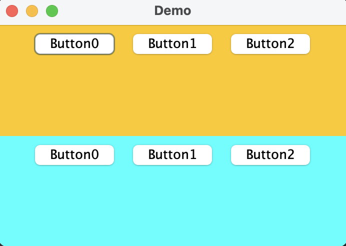

## Part II - Layout managers

### 05 - FlowLayout example 

- <small><a href="https://github.com/pagliares/swing-hands-on#outline">Back to Outline</a></small>
- <strong>Project source:</strong> flow-layout-example

<strong>Summary</strong>

This Java code creates a simple window with three buttons using the FlowLayout layout manager.

The FlowLayoutExemplo class defines a constructor that initializes the JFrame object with the title passed as an argument and creates three JButton objects.

The configuraJanela() method sets the JFrame layout to FlowLayout and adds the three buttons to it. Then it packs the components to calculate the preferred size of the window and makes it visible.

The main method creates an instance of FlowLayoutExemplo and calls its configuraJanela() method to display the window with the three buttons.

Overall, this code demonstrates the use of the FlowLayout layout manager to arrange components in a single row, wrapping them to the next line if necessary.

 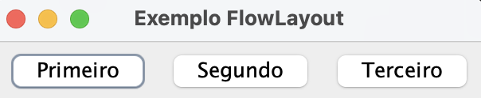

### 06 - BorderLayout example 

- <small><a href="https://github.com/pagliares/swing-hands-on#outline">Back to Outline</a></small>
- <strong>Project source:</strong> border-layout-example

<strong>Summary</strong>

This Java code creates a simple window with five buttons using the BorderLayout layout manager.

The BorderLayoutExemplo class defines a constructor that initializes the JFrame object with the title passed as an argument and creates five JButton objects for the different regions of the border layout.

The configuraJanela() method sets the JFrame layout to BorderLayout and adds the five buttons to their respective positions. The BorderLayout manager divides the container into five areas: North, South, East, West, and Center. The JButton objects are added to their respective positions by calling add() method with the button and the corresponding position constant from the BorderLayout class.

The setSize() method sets the size of the window and the setVisible() method makes the window visible.

The main method creates an instance of BorderLayoutExemplo and calls its configuraJanela() method to display the window with the five buttons.

Overall, this code demonstrates the use of the BorderLayout layout manager to arrange components in five regions of a container.

 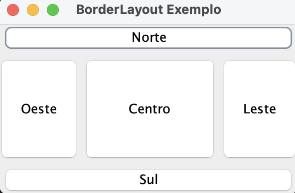

### 07 - GridLayout example 

- <small><a href="https://github.com/pagliares/swing-hands-on#outline">Back to Outline</a></small>
- <strong>Project source:</strong> grid-layout-example

<strong>Summary</strong>

This is a Java program that creates a window with a grid layout of two rows and three columns, and adds six buttons to it.

The program creates a class called GridLayoutExemplo that extends JFrame. In the constructor, it takes a string argument titulo which is used as the title of the window. It also creates six button objects btn1 through btn6.

The configuraJanela() method configures the layout of the window using a GridLayout with two rows and three columns. It then adds the six buttons to the window using the add() method. Finally, it sets the size of the window to 300x200 pixels and makes it visible.

The main() method creates an instance of the GridLayoutExemplo class and calls the configuraJanela() method to display the window with the buttons arranged in a 2x3 grid.

 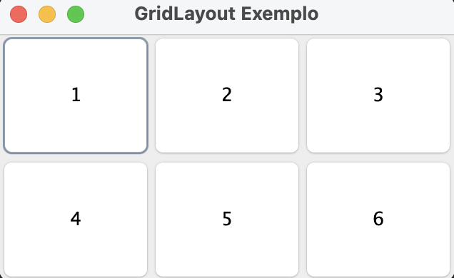

### 08 - BoxLayout example 

- <small><a href="https://github.com/pagliares/swing-hands-on#outline">Back to Outline</a></small>
- <strong>Project source:</strong> box-layout-example

<strong>Summary</strong>

This Java program defines a class named BoxLayoutFrame that extends JFrame and creates a GUI with several Box containers that use different types of layout.

The GUI contains a JTabbedPane with five tabs, each containing a Box container with buttons arranged in a specific layout. The first tab uses a horizontal Box with buttons, the second tab uses a vertical Box with struts (empty space), the third tab uses a horizontal Box with glue (flexible space), the fourth tab uses a vertical Box with rigid areas (fixed-size empty space), and the fifth tab uses a vertical Box with glue.

The program defines a constructor for the BoxLayoutFrame class that creates the Box containers and adds them to the JTabbedPane. The main method creates an instance of BoxLayoutFrame and sets its size and visibility.

When the program runs, it displays a window with a tabbed pane that allows the user to switch between the different Box layouts and see how they affect the arrangement of the buttons.

 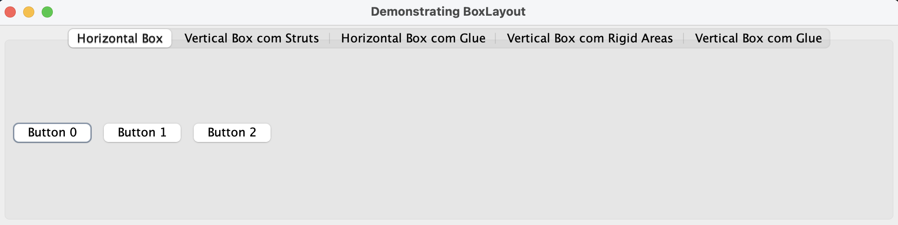

 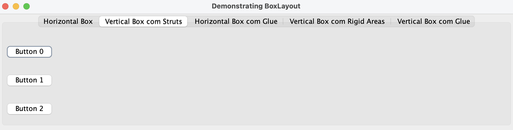

 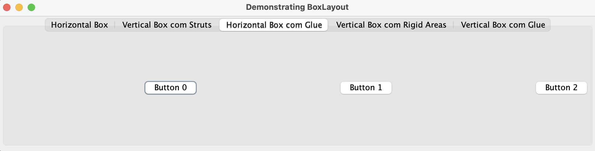

 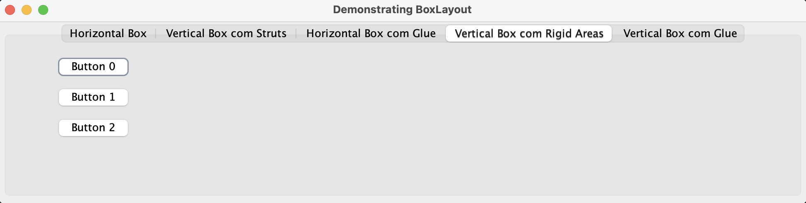

 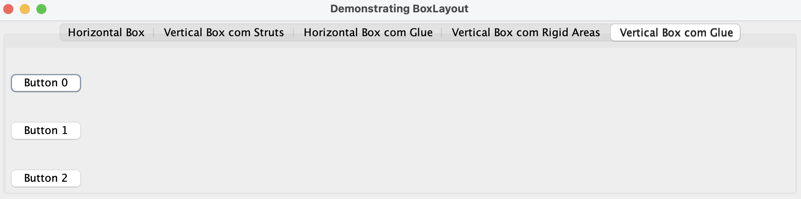

### 09 - GridBagLayout example 

- <small><a href="https://github.com/pagliares/swing-hands-on#outline">Back to Outline</a></small>
- <strong>Project source:</strong> grid-bag-layout-example

<strong>Summary</strong>

This is a Java code example that creates a window with a flexible grid layout, using the GridBagLayout class. The layout allows components to be positioned in cells of a grid and configured with different constraints for each component, such as weight, fill, anchor, and grid width/height.

The code creates several Swing components, including JTextArea, JComboBox, JTextField, and JButton, and adds them to the layout using the addComponent method, which takes the component, row, column, width, and height as parameters. The constraints for each component are set using the GridBagConstraints class, which is instantiated in the constructor.

The main method creates an instance of the GridBagFrame class, sets the default close operation, sets the size of the frame, and displays it on the screen.

Overall, this code is an example of how to use the GridBagLayout to create a custom layout for a Swing application in Java.

 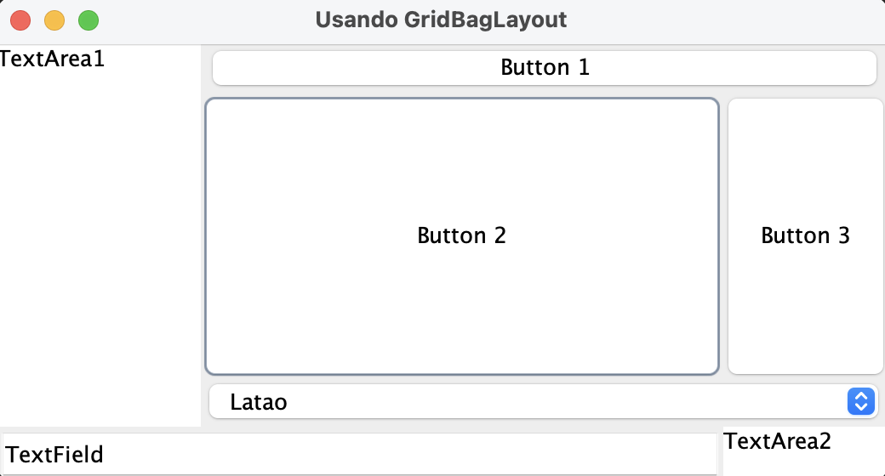

## Part III - Event handlers, adapter classes, and inner classes

### 10 - ActionListener example 

- <small><a href="https://github.com/pagliares/swing-hands-on#outline">Back to Outline</a></small>
- <strong>Project source:</strong> action-listener-example

<strong>Summary</strong>

This is a Java class named "ExemploActionListener" that implements the ActionListener interface. It has three instance variables: two JButtons named "btn1" and "btn2", and a JFrame named "frame".

The constructor for this class takes a String argument which is used as the title for the JFrame.

There is a method named "configurarJanela" that sets the layout of the frame to a FlowLayout and creates two buttons ("btn1" and "btn2") with text labels "Primeiro" and "Segundo", respectively. It then registers "this" object (an instance of ExemploActionListener) as the ActionListener for both buttons, adds the buttons to the frame, packs the frame to calculate its size, and sets it to be visible.

Finally, there is an implementation of the actionPerformed method from the ActionListener interface that displays a message dialog with the text label of the button that was clicked.

The main method creates an instance of the ExemploActionListener class and calls the "configurarJanela" method to set up and display the JFrame.

 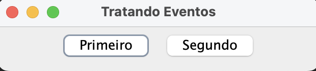

 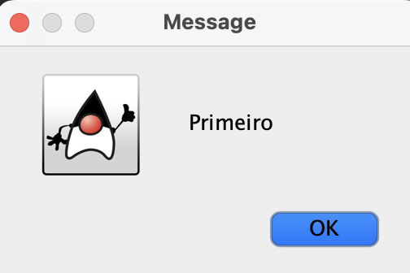

 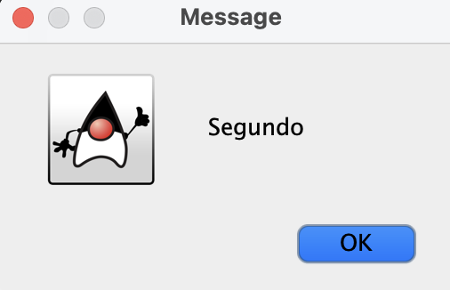

### 11 - MouseListener example 

- <small><a href="https://github.com/pagliares/swing-hands-on#outline">Back to Outline</a></small>
- <strong>Project source:</strong> mouse-listener-example

<strong>Summary</strong>

This is a Java code example that demonstrates how to handle events from a mouse using an implementation of the MouseListener interface.

The code creates a JFrame and adds two JButtons to it. The code also implements the ActionListener interface, so it can handle action events from the JButtons.

In the configurarJanela method, the code registers the instance of the class as a listener for both mouse and action events on each button.

In the mouseEntered and mouseExited methods, the code changes the text of the button that the mouse is hovering over.

In the actionPerformed method, the code displays a message dialog showing the label of the button that was clicked.

The main method creates an instance of the ExemploMouseListener class and calls the configurarJanela method to display the JFrame with the two buttons.

 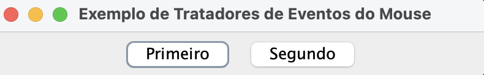

 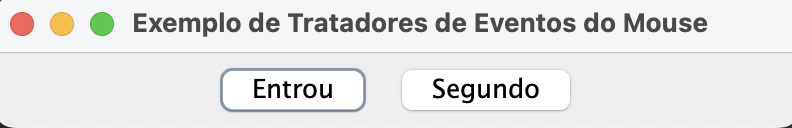

 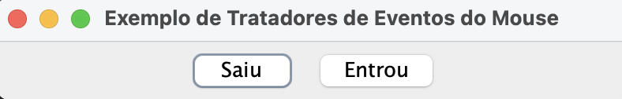

### 12 - Inner classes  

- <small><a href="https://github.com/pagliares/swing-hands-on#outline">Back to Outline</a></small>
- <strong>Project source:</strong> inner-classes-example

<strong>Summary</strong>

<strong>Example #1</strong> 

This first inner class example (ExemploClasseInternaEstatica)  demonstrates the use of static inner classes. The outer class, ExemploClasseInternaEstatica, contains two static inner classes: InternaUm and InternaDois.

InternaUm has a static field campoInterna1 and a static method metodoInterno(). The method prints a message to the console, sets campoInterna1 to 15, and returns void.

InternaDois extends InternaUm and has a static field campoInterna2 and a static method metodoInterno(). The method prints a message to the console, sets campoInterna2 to 55, and returns void.

In the main method, we call InternaUm.metodoInterno(), which sets campoInterna1 to 15 and prints a message to the console. We then print the value of InternaUm.campoInterna1 to the console, which should be 15.

We then call InternaDois.metodoInterno(), which sets campoInterna2 to 55 and prints a message to the console. We print the value of InternaDois.campoInterna2 to the console, which should be 55.

The purpose of this code is to demonstrate how to define and use static inner classes in Java. Static inner classes are nested classes that are declared as static, which means that they can be accessed without creating an instance of the outer class. In this example, we access the static fields and methods of InternaUm and InternaDois directly, without creating an instance of ExemploClasseInternaEstatica.

<strong>Example #2</strong> 

The second inner class example (ExemploClasseInternaDeInstancia) demonstrates the use of an inner class within an outer class instance.

The outer class, ExemploClasseInternaDeInstancia, has a field campoUm and a private inner class Interna. Interna has two fields, campoUm and campoDois, and a method metodoInterno() that sets and prints the values of these fields.

The metodoInterno() method first sets the campoUm field of the outer class instance to 10 and prints a message to the console. It then sets the campoUm field of the inner class instance to 15 and prints a message to the console. Finally, it sets the campoDois field of the inner class instance to 50 and prints a message to the console.

The Interna class also has a method getCampoUmClasseExterna() that returns the value of campoUm from the outer class instance.

In the main method, we create an instance of ExemploClasseInternaDeInstancia and an instance of Interna using the new keyword with the outer class instance (e) as a qualifier. We then call i.metodoInterno(), which sets and prints the values of the Interna fields and the outer class field.

We print the values of the Interna fields and the outer class field to the console using the instance of Interna (i). We also call i.getCampoUmClasseExterna() to get the value of campoUm from the outer class instance and print it to the console.

The purpose of this code is to demonstrate how to define and use an inner class within an outer class instance in Java. An inner class can access the fields and methods of the outer class, and can also have its own fields and methods. When creating an instance of the inner class, we need to use the new keyword with the outer class instance as a qualifier.

<strong>Example #3</strong> 

The third inner class example (ExemploClasseEmbutida) demonstrates the use of a local inner class within a method.

The ExemploClasseEmbutida class has a method calcular that takes two int parameters a and b. Inside the calcular method, we define a local inner class Interna that implements the Multiplicavel interface. The Interna class has a method produto that returns the product of a and b.

We then create an instance of the Interna class and return it from the calcular method. The Interna class has access to the a and b parameters of the calcular method, which are marked as final to ensure that their values cannot be changed.

In the main method, we create an instance of ExemploClasseEmbutida and call its calcular method with the parameters 2 and 3. This returns an instance of the Interna class, which is assigned to a variable of type Multiplicavel.

We then call the produto method on the Multiplicavel instance to get the product of 2 and 3, which is 6. We print this value to the console.

The purpose of this code is to demonstrate the use of a local inner class to encapsulate behavior that is specific to a particular method. By defining the Interna class inside the calcular method, we ensure that it is only visible and accessible within the context of that method. This can make the code more modular and easier to understand.

### 13 - Closing a JFrame - Strategy #1  

- <small><a href="https://github.com/pagliares/swing-hands-on#outline">Back to Outline</a></small>
- <strong>Project source:</strong> jframe-closing-fist-strategy

<strong>Summary</strong>

This is a Java program that creates a simple graphical user interface (GUI) using the Swing framework. The program creates a JFrame window with a title "Fechando o JFrame" and a size of 300 x 200 pixels. The window is set to be visible by calling the setVisible(true) method on the JFrame object.

The program also registers a WindowListener object, TratadorJanela, to handle window events. In this case, the windowClosing method is implemented to terminate the program when the user clicks on the close button of the JFrame. The System.exit(0) method is called to terminate the program with a normal exit status.

The main method creates an instance of the FechaJFrame1 class, which in turn creates the JFrame window and registers the TratadorJanela object as the window listener. When the user closes the window, the windowClosing method is called, and the program terminates.

### 14 - Closing a JFrame - Strategy #2  

- <small><a href="https://github.com/pagliares/swing-hands-on#outline">Back to Outline</a></small>
- <strong>Project source:</strong> jframe-closing-second-strategy

<strong>Summary</strong>

Similar to the previous example, this is also a Java program that creates a simple graphical user interface (GUI) using the Swing framework. The program creates a JFrame window with a title "Fechando o JFrame" and a size of 300 x 200 pixels. The window is set to be visible by calling the setVisible(true) method on the JFrame object.

In this version of the program, the setDefaultCloseOperation method is used to specify the default close operation for the JFrame window. The EXIT_ON_CLOSE constant is passed as an argument to this method to indicate that the program should exit when the user clicks on the close button of the JFrame. This is a simpler way to handle window closing events, as it automatically terminates the program without the need to register a WindowListener object.

The main method creates an instance of the FechaJFrame2 class, which in turn creates the JFrame window and sets the default close operation to EXIT_ON_CLOSE. When the user closes the window, the program terminates.

### 15 - Inner classes and event handling  

- <small><a href="https://github.com/pagliares/swing-hands-on#outline">Back to Outline</a></small>
- <strong>Project source:</strong> inner-class-event-handler

<strong>Summary</strong>

This is a Java program that creates a simple graphical user interface (GUI) using the Swing framework. The program creates a JFrame window with a label and a text field, and registers two mouse event listeners, MeuMouseListener and TratadorCliqueMouse, to handle mouse events.

The MeuMouseListener class is an inner class that extends the MouseMotionAdapter class and overrides the mouseDragged method. This method is called when the user drags the mouse within the window, and it updates the text field with the current X and Y coordinates of the mouse.

The TratadorCliqueMouse class is another inner class that extends the MouseAdapter class and overrides the mouseClicked method. This method is called when the user clicks the mouse within the window, and it updates the text field with the X and Y coordinates of the mouse at the click location.

The exibeFrame method adds the label and the text field to the JFrame window, registers the two mouse event listeners to handle mouse events, and sets the size and visibility of the window. The main method creates an instance of the TestaClasseAninhada class and calls the exibeFrame method to display the GUI.

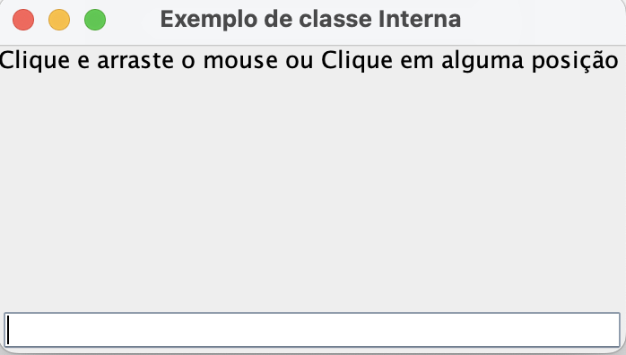

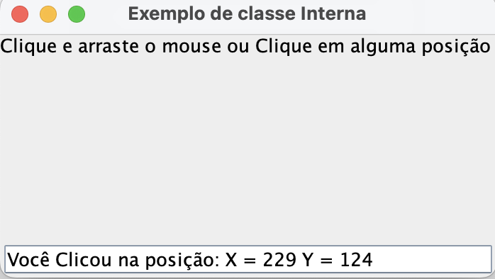

### 16 - Anonymous classes and event handling  

- <small><a href="https://github.com/pagliares/swing-hands-on#outline">Back to Outline</a></small>
- <strong>Project source:</strong> anonymous-class-event-handler

<strong>Summary</strong>

- This example is identical to the previous one with the exception it uses an anonymous class. In other words, the program creates a JFrame window with a label and a text field, and registers two mouse event listeners, one of which is a anonymous class.

## Part IV - Swing components

### 17 - JFrame and changing the look and feel 

- <small><a href="https://github.com/pagliares/swing-hands-on#outline">Back to Outline</a></small>
- <strong>Project source:</strong> jframe-example

<strong>Summary</strong>

This Java code example contains a helper class WindowUtilities that provides methods to set the look and feel of Swing applications to native, Java, or Motif. It also includes methods to create a JFrame and set its content, size, and background color, as well as an ExitListener class that exits the application when the JFrame is closed. The JFrameExample class uses these utilities to create a simple JFrame with three buttons arranged using the FlowLayout manager. When the JFrame is closed, the ExitListener class exits the application.

 
<strong>
Native Look and feel
</strong>

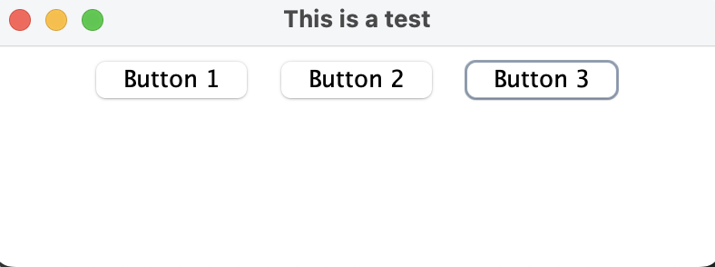

 
<strong>
Motif Look and feel
</strong>

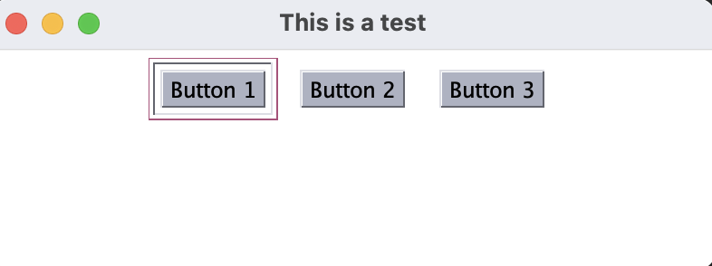

 
<strong>
Java Look and feel
</strong>

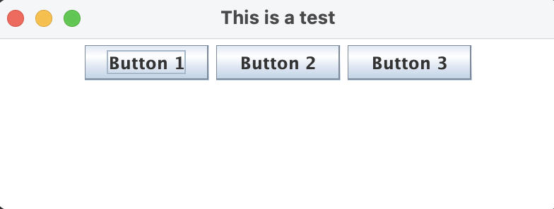

