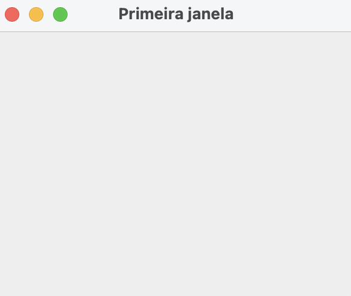
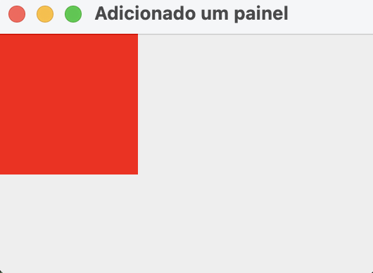

# Swing hands-on

Welcome to the repository containing examples used in the Java Desktop Development with Swing classes taught by Rodrigo Martins Pagliares in the Computer Science undergraduate course at UNIFAL-MG, Brazil. 

I thinnk this repository is a valuable resource for students who want to review class examples or further explore Swing development. I hope you find it helpful and informative!

## Outline

### Part I - First steps with Swing

<a href="https://github.com/pagliares/swing-hands-on#01---first-jframe-composition">01 - First JFrame - Composition</a>

<a href="https://github.com/pagliares/swing-hands-on#02---first-jframe-inheritance">02 - Second JFrame - Inheritance</a>

## Part I - First steps with Swing

### 01 - First JFrame (Composition)

- <small><a href="https://github.com/pagliares/swing-hands-on#outline">Back to Outline</a></small>
- <strong>Project source:</strong> first-jframe

<strong>Summary</strong>

This example creates a basic GUI window using the Swing framework. It is organized into a single class called PrimeiraJanela, which contains a single method called main().

The main() method is the entry point of the program and is the first method to be executed when the program is run. It creates a new JFrame object and sets its title to "Primeira janela" using the constructor.

Next, it sets the size of the window using the setSize() method, which takes two arguments: the width and height of the window in pixels. In this case, the width is set to 300 pixels and the height is set to 250 pixels.

Finally, the program sets the visibility of the window to true using the setVisible() method, which shows the window on the screen.

In summary, this code creates a basic Swing GUI window with a specified size and title and makes it visible on the screen. It's a simple but essential starting point for creating more complex GUI applications in Java.

 

### 02 - First JFrame (Inheritance)

- <small><a href="https://github.com/pagliares/swing-hands-on#outline">Back to Outline</a></small>
- <strong>Project source:</strong> second-jframe

<strong>Summary</strong>

This example is identical to the first except that this time I use inheritance instead of composition.

### 03 - First JPanel  

- <small><a href="https://github.com/pagliares/swing-hands-on#outline">Back to Outline</a></small>
- <strong>Project source:</strong> panel-example

<strong>Summary</strong>

This Java Swing example creates a window with a red panel inside of it.

First, the necessary classes are imported: Color and JFrame from java.awt package and JPanel from javax.swing package.

Then, the ExemploPainel class is defined, which has a JFrame and a JPanel as its fields. The constructor takes a string parameter titulo which is used as the title of the JFrame. In the constructor, a new JFrame is created with the provided title and a new JPanel is created.

The configurarJanela method sets up the window. First, the size of the window is set to 300 x 200 using jFrame.setSize(300, 200). Then, the layout is disabled by calling jFrame.setLayout(null). The size of the panel is set to 100 x 100 using jPanel.setSize(100, 100) and the background color of the panel is set to red using jPanel.setBackground(Color.RED).

Finally, the panel is added to the frame using jFrame.add(jPanel) and the window is made visible by calling jFrame.setVisible(true).

The main method creates an instance of the ExemploPainel class, passing in the title "Adicionado um painel", and calls the configurarJanela method on that instance to display the window.

 

